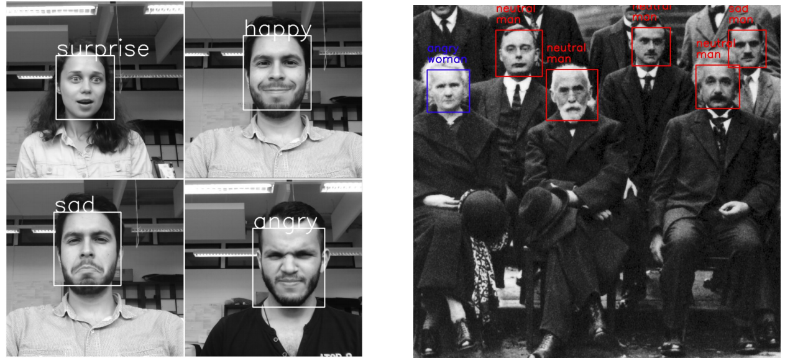

# Face Emotion & Gender Classification

Real-time face detection, emotion recognition, and gender classification using CNN models with OpenCV and TensorFlow / Keras.

- **Gender classification accuracy (IMDB):** ~96%
- **Emotion classification accuracy (FER2013):** ~66%

---

## Demos & Results

### Emotion and Gender Classification


### Real-Time Demo
<div align='center'>
  
</div>

---

## Quickstart

### 1. Installation

Create a virtual environment and install dependencies:

```bash
python3 -m venv .venv
source .venv/bin/activate
pip install -r requirements.txt
```

*(For Apple Silicon macOS, you can also use `pip install tensorflow-macos opencv-python pandas numpy h5py matplotlib scipy Pillow Flask`)*

---

### 2. Run Inference on an Image

```bash
python3 main.py --image images/test_image.jpg
```

Or using the legacy script in `src/`:

```bash
python3 src/image_emotion_gender_demo.py images/test_image.jpg
```

The output image with bounding boxes and labels will be saved to `images/predicted_test_image.png`.

---

### 3. Run Real-Time Webcam Demo

```bash
python3 main.py --webcam
```

Or:

```bash
python3 src/video_emotion_gender_demo.py
```

Press `q` to exit the video stream.

---

### 4. Run Guided Back-Propagation / Grad-CAM Demo

```bash
python3 src/image_gradcam_demo.py images/test_image.jpg
```

---

### 5. Run Web Server API

Start the Flask REST API:

```bash
python3 main.py --server --port 8084
```

Send an image for classification:

```bash
curl -F "image=@images/test_image.jpg" http://localhost:8084/classifyImage --output output.png
```

---

## Training Models

### Emotion Classifier (FER2013)
1. Download `fer2013.tar.gz` from Kaggle.
2. Place and extract in `datasets/`:
   ```bash
   tar -xzf fer2013.tar -C datasets/
   ```
3. Run training:
   ```bash
   python3 src/train_emotion_classifier.py
   ```

### Gender Classifier (IMDB-WIKI)
1. Download `imdb_crop.tar` from IMDB-WIKI dataset.
2. Extract in `datasets/`:
   ```bash
   tar -xf imdb_crop.tar -C datasets/
   ```
3. Run training:
   ```bash
   python3 src/train_gender_classifier.py
   ```

---

## Project Structure

```
.
├── main.py                  # CLI entry point (image, webcam, server)
├── requirements.txt         # Project dependencies
├── datasets/                # Dataset directory
├── images/                  # Sample test images and demo gifs
├── src/                     # Source code
│   ├── models/              # CNN architectures (mini_XCEPTION, simple_CNN)
│   ├── utils/               # Preprocessing, datasets, inference, Grad-CAM
│   ├── web/                 # Flask API server
│   ├── image_emotion_gender_demo.py
│   ├── video_emotion_gender_demo.py
│   ├── train_emotion_classifier.py
│   └── train_gender_classifier.py
└── trained_models/          # Pretrained HDF5 and Haar cascade models
```

---

## License

MIT License. See [LICENSE](LICENSE) for details.
